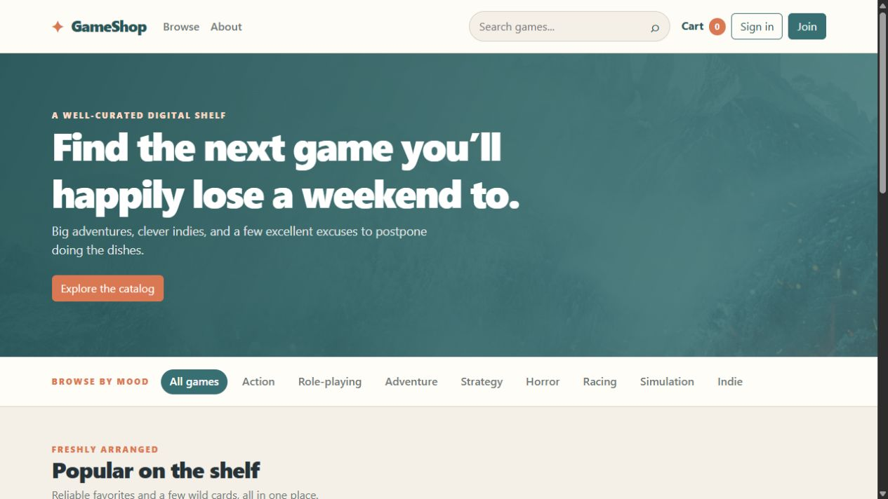

# GameShop

GameShop is a deliberately old-school Java web store: JSP pages, Jakarta Servlets, a small DAO layer, and Maven packaging a WAR for Tomcat. The refresh keeps that shape, but makes the application easier to run and less internally contradictory.

## What is included

- Browse, search, and filter a seeded game catalog
- Product detail pages with related games
- Session shopping cart with quantity controls
- Demo checkout that writes orders and order items to SQLite
- Registration, login, logout, and account management
- Admin-only catalog editing, account management, and price/rating charts
- A warm paper-style light UI with Bootstrap 5.3.2 and a small shared stylesheet

## Stack

- Java 11
- Jakarta Servlet 5 / JSP 3 / JSTL 2
- Apache Maven
- Apache Tomcat 10.x
- SQLite through the Xerial JDBC driver
- Bootstrap 5.3.2, loaded from the existing WebJars dependency and CDN stylesheet/script links

## Project layout

```text
.
├── pom.xml
├── src/
│   ├── java/
│   │   ├── controller/       # Jakarta Servlets
│   │   ├── dal/              # SQLite connection and DAO
│   │   └── model/            # Catalog, account, cart, and item models
│   └── resources/
│       └── GameStore_sqlite.sql  # Schema and realistic demo seed data
└── web/
    ├── WEB-INF/web.xml       # WAR descriptor and session settings
    ├── META-INF/context.xml  # Minimal Tomcat context; no server-side DB pool
    ├── common/               # Shared JSP head/scripts
    ├── css/common.css        # Shared paper-toned theme
    └── *.jsp                 # Legacy JSP views
```

The old PostgreSQL dump, unused order model classes, missing page-specific stylesheets, and unused `changeinfo.jsp` notification page were removed. Orders are still stored, but the current UI intentionally keeps checkout as a simple demo purchase flow rather than pretending to be a full payment platform.

## Preview



## Run locally

### Requirements

- JDK 11
- Maven 3.6+
- Tomcat 10.x

No PostgreSQL installation or database setup is required. On the first database access, `DBContext` creates `GameStore.db` in the application’s working directory and executes `src/resources/GameStore_sqlite.sql`. The database file is ignored by Git.

To use another location, pass a SQLite JDBC URL when starting Tomcat:

```text
-Dgamestore.db.url=jdbc:sqlite:C:/path/to/GameStore.db
```

### Build and deploy

```sh
mvn clean package
```

This workspace also has a project-local Maven 3.9.16 installation under `.tools/` for machines where Maven is not on `PATH`:

```powershell
.\.tools\apache-maven-3.9.16\bin\mvn.cmd clean package
```

The `.tools/` directory and local `.m2/` dependency cache are ignored by Git.

Deploy `target/myproject.war` to Tomcat 10.x. The application is intended to be available at:

```text
http://localhost:8080/myproject/
```

### Demo accounts

| Username | Password | Access |
| --- | --- | --- |
| `admin@gamestore.com` | `admin123` | Administrator |
| `maya.chen` | `gamer123` | Customer |
| `alex.rivera` | `gamer123` | Customer |
| `noah.wilson` | `gamer123` | Customer |

These are intentionally simple seed credentials for a local legacy demo. Do not reuse them in a real deployment; the original application’s plain-text password convention is preserved only to avoid introducing a new authentication stack.

## Notes for maintenance

- The DAO uses SQLite-compatible SQL. Search is implemented with `LOWER(...) LIKE ...`, not PostgreSQL-specific `ILIKE`.
- Database dates are stored as ISO `YYYY-MM-DD`. The model exposes `dd/MM/yyyy` for the catalog and a separate ISO value for HTML date inputs.
- Admin checks remain in the servlets because this project uses application-managed sessions rather than container-managed authentication.
- External Steam CDN image URLs are seed content, not application uploads. If an image moves, update the matching row in `GameStore_sqlite.sql` or through the admin editor.
